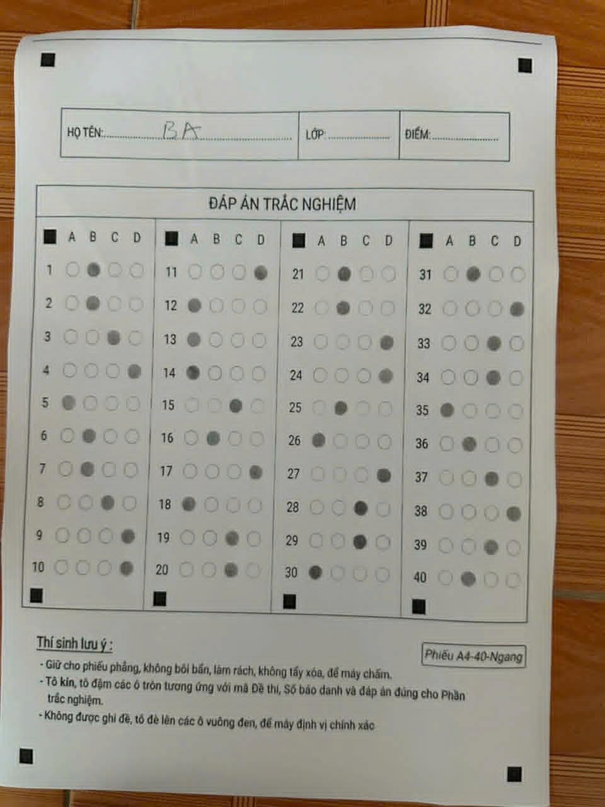
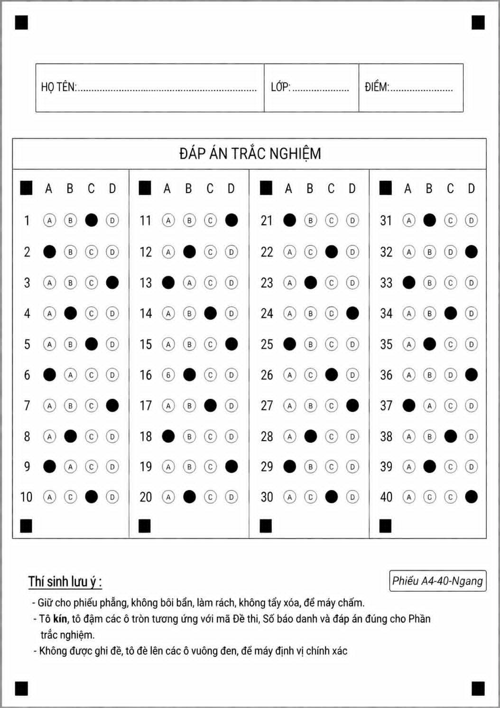
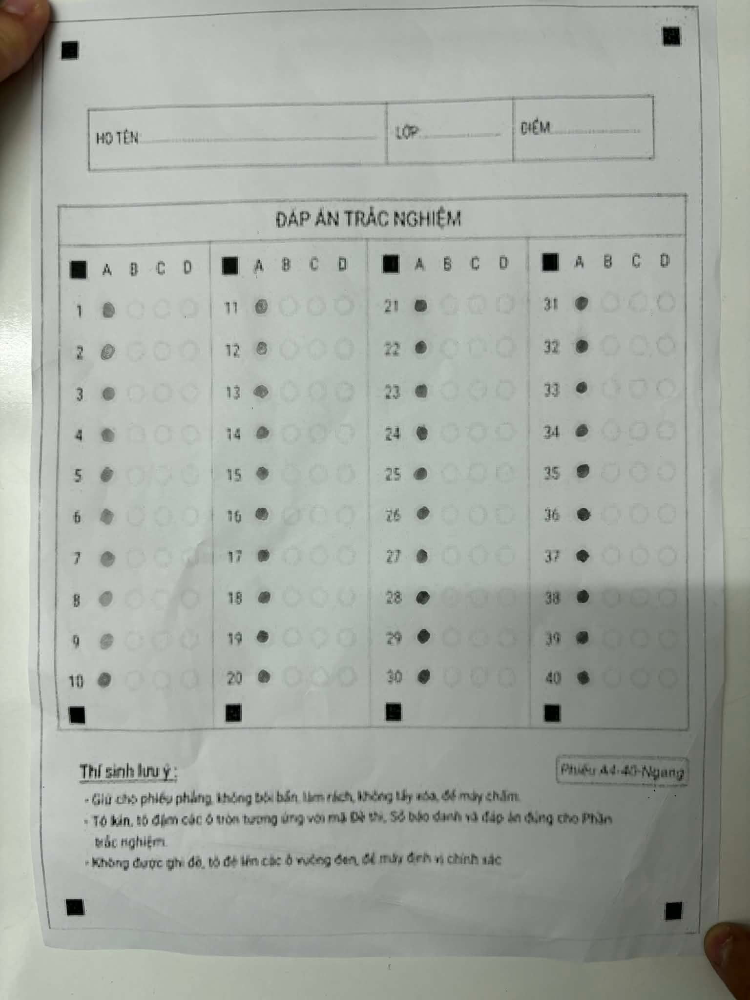
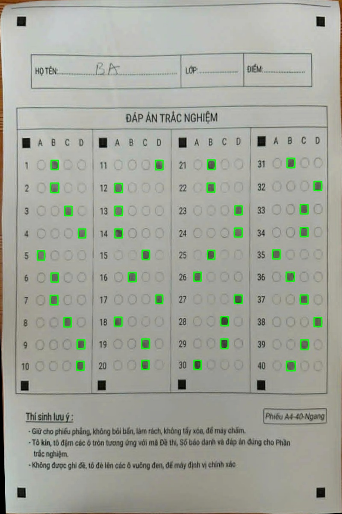
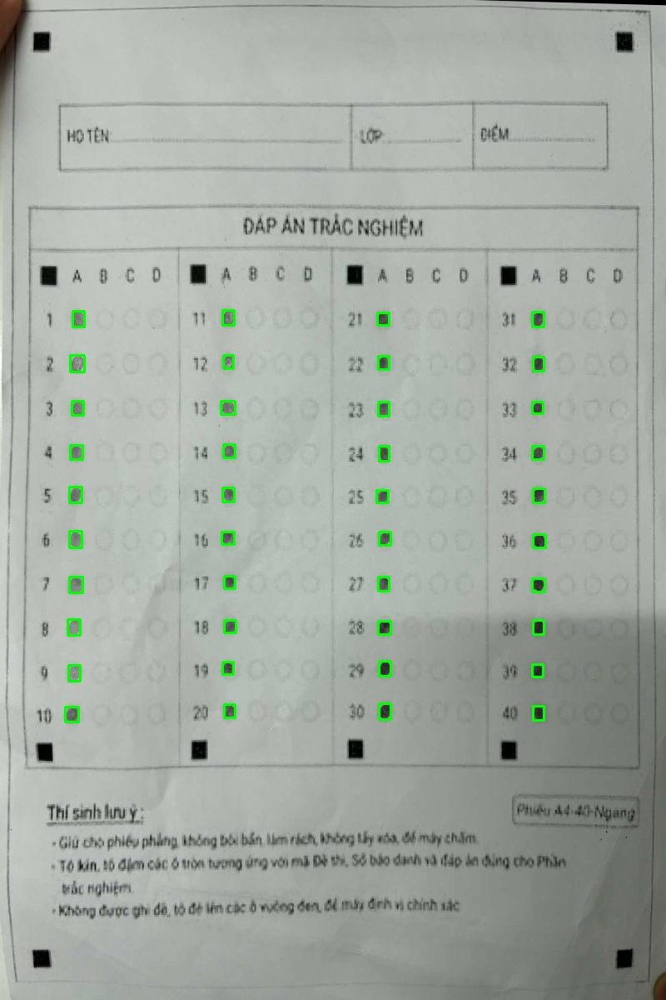

# OMR Vision API

An **Optical Mark Recognition (OMR)** system for automatic exam grading, built with **Java + Spring Boot + JavaCV (OpenCV) + Tesseract OCR**. Works reliably on both flat scans and smartphone photos with shadows and perspective skew.

---

## Prerequisites

| Dependency | Version |
|---|---|
| JDK | 25+ |
| Tesseract OCR | 5.x (native install on OS) |

**Install Tesseract on Ubuntu/Debian:**
```bash
sudo apt install tesseract-ocr tesseract-ocr-vie
```

**Copy language files into `tessdata/`:**
```bash
mkdir -p tessdata
cp /usr/share/tesseract-ocr/5/tessdata/vie.traineddata tessdata/
cp /usr/share/tesseract-ocr/5/tessdata/eng.traineddata tessdata/
```

---

## Run the Server

```bash
./mvnw spring-boot:run
```

Server starts at `http://localhost:8080`.

---

## Run Tests

```bash
./mvnw test
```

The test suite processes all **5 real answer sheets** in `data/` (both flat scans and phone photos) and asserts 100% extraction accuracy per question. Debug overlay images are written to `data/debug/` after each run.

---

## API Usage

**Endpoint:** `POST /api/v1/grade`  
**Content-Type:** `multipart/form-data`

| Field | Description |
|---|---|
| `image` | Answer sheet image (JPEG/PNG) |
| `answers` | CSV file containing the answer key |

**Answer key CSV format:**
```csv
questionNumber,correctAnswer
1,B
2,B
3,C
...
40,B
```

**Example — grade `data/test_1.jpeg` with curl:**
```bash
cat > /tmp/answers.csv << 'EOF'
questionNumber,correctAnswer
1,B
2,B
3,C
4,D
5,A
6,B
7,B
8,C
9,D
10,D
11,D
12,A
13,A
14,A
15,C
16,B
17,D
18,A
19,C
20,C
21,B
22,B
23,D
24,D
25,B
26,A
27,D
28,C
29,C
30,A
31,B
32,D
33,C
34,C
35,A
36,B
37,C
38,D
39,C
40,B
EOF

curl -s -X POST http://localhost:8080/api/v1/grade \
  -F "image=@data/test_1.jpeg" \
  -F "answers=@/tmp/answers.csv" | python3 -m json.tool
```

**Response:**
```json
{
  "studentName": "BA",
  "className": "",
  "score": 10.0,
  "correctCount": 40,
  "totalQuestions": 40,
  "incorrectQuestions": [],
  "studentAnswers": {
    "1": "B", "2": "B", "3": "C", "4": "D", "5": "A",
    "6": "B", "7": "B", "8": "C", "9": "D", "10": "D",
    "11": "D", "12": "A", "13": "A", "14": "A", "15": "C",
    "16": "B", "17": "D", "18": "A", "19": "C", "20": "C",
    "21": "B", "22": "B", "23": "D", "24": "D", "25": "B",
    "26": "A", "27": "D", "28": "C", "29": "C", "30": "A",
    "31": "B", "32": "D", "33": "C", "34": "C", "35": "A",
    "36": "B", "37": "C", "38": "D", "39": "C", "40": "B"
  }
}
```

---

## Test Images (`data/`)

Five real answer sheets used by the test suite:

| File | Description |
|---|---|
| `test_1.jpeg` | Smartphone photo — tilted, shadow on background |
| `test_2.jpeg` | Flat scan — varied answer pattern |
| `test_3.jpeg` | Smartphone photo — low light, all answers marked A |
| `test_4.jpeg` | Smartphone photo — includes a double-marked bubble (AC) |
| `test_5.jpeg` | Smartphone photo — same pattern as test_4 |

### `test_1.jpeg` — smartphone photo, tilted angle


### `test_2.jpeg` — flat scan


### `test_3.jpeg` — smartphone photo, low light, all A


---

## Debug Output (`data/debug/`)

After running the tests, a grid visualization is saved for each image. Each bubble cell is outlined and the detected filled bubble is highlighted in green.

### `debug_grid_test_1.jpeg` — detected answers from a tilted phone photo


### `debug_grid_test_3.jpeg` — all bubbles detected as A


---

## Processing Pipeline

```
Input image
    │
    ▼
[alignImage]       findContours → warpPerspective → 1000×1400 canvas
    │
    ▼
[Adaptive Threshold]   Gaussian adaptive thresholding, handles shadows
    │
    ▼
[extractAnswers]   meanIntensity per cell → filter filled vs hollow bubbles
    │
    ▼
[TesseractOCR]     extract student name and class from handwriting region
    │
    ▼
[GradingService]   compare against answer key CSV → return JSON result
```

## Tech Stack

- **Java 25** / **Spring Boot 4.0.x**
- **JavaCV 1.5.10** (OpenCV bindings)
- **Tess4j 5.11.0** (Tesseract OCR)
- **OpenCSV 5.9**
- **Lombok**

## License

MIT
